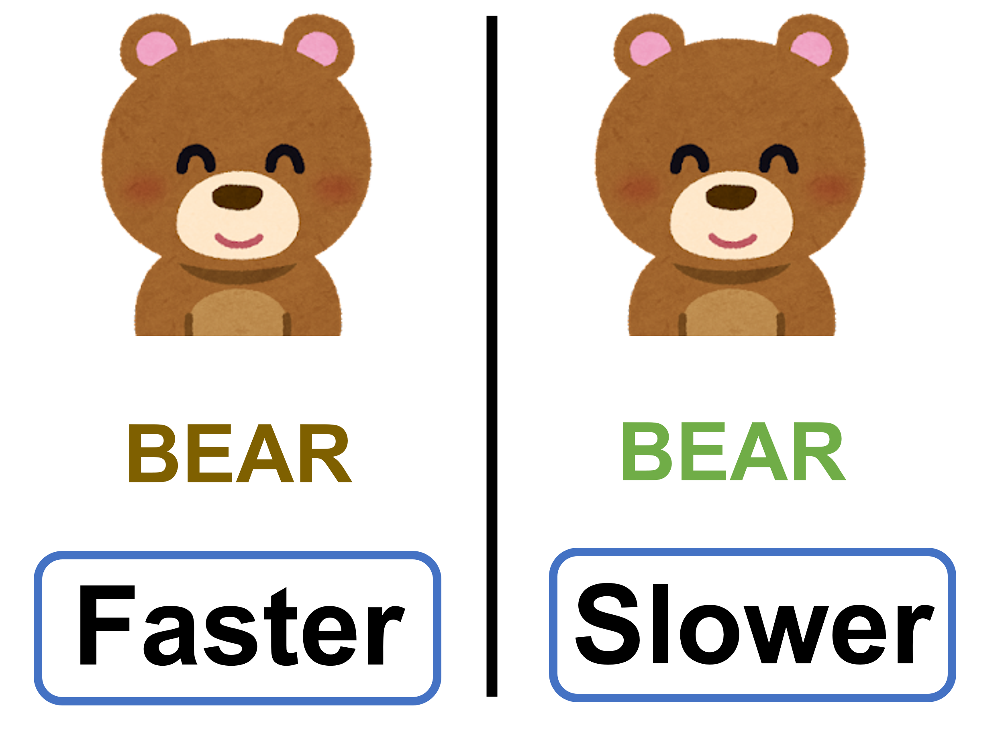
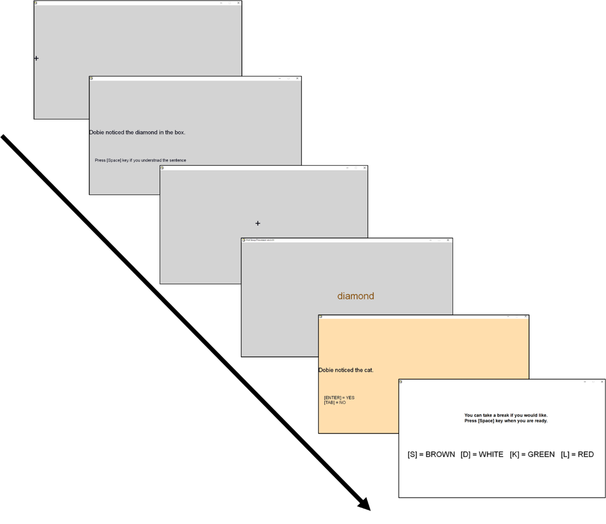
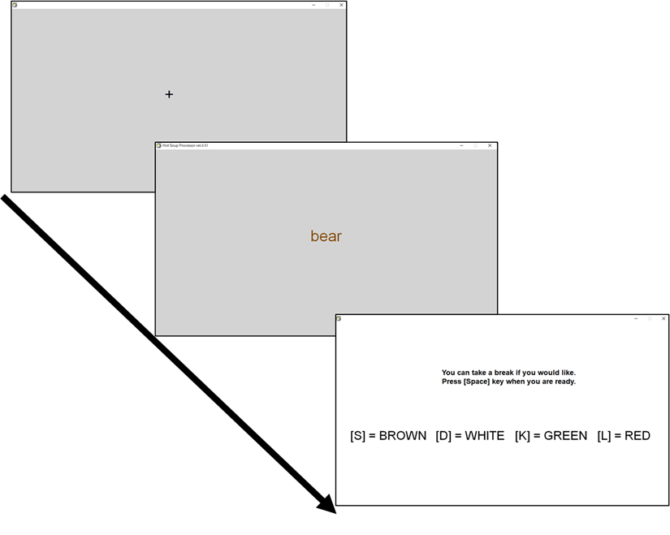
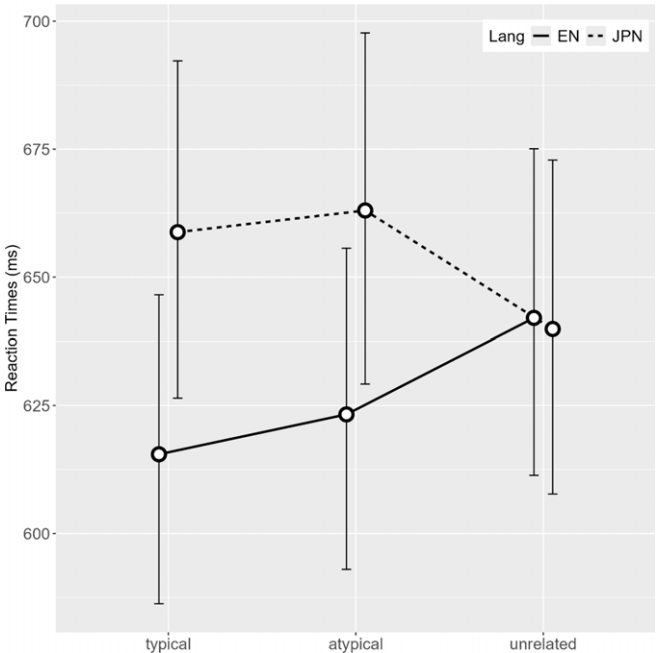
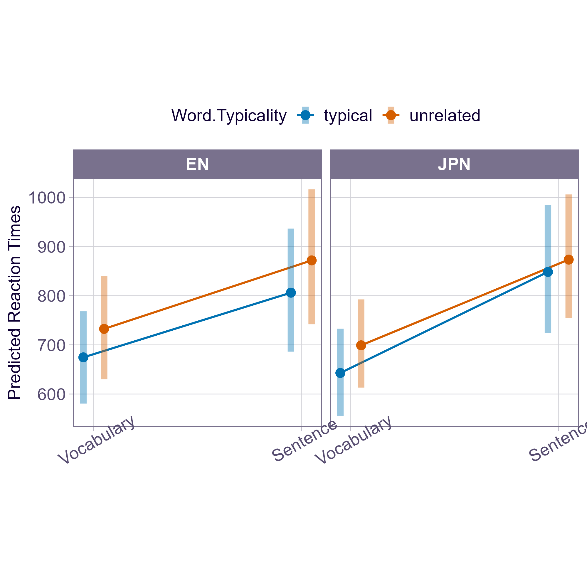
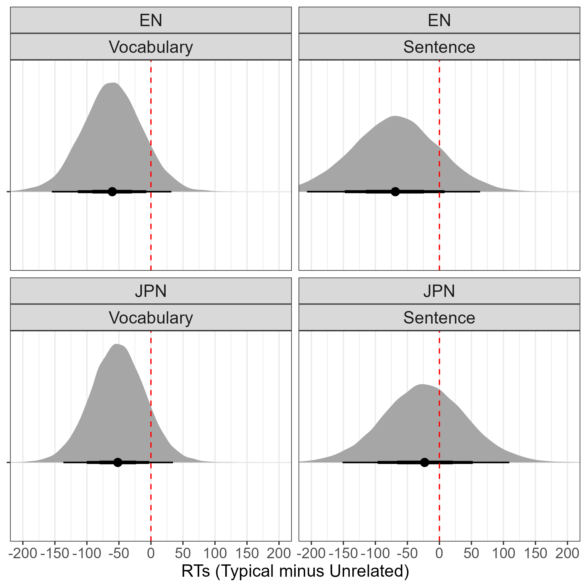
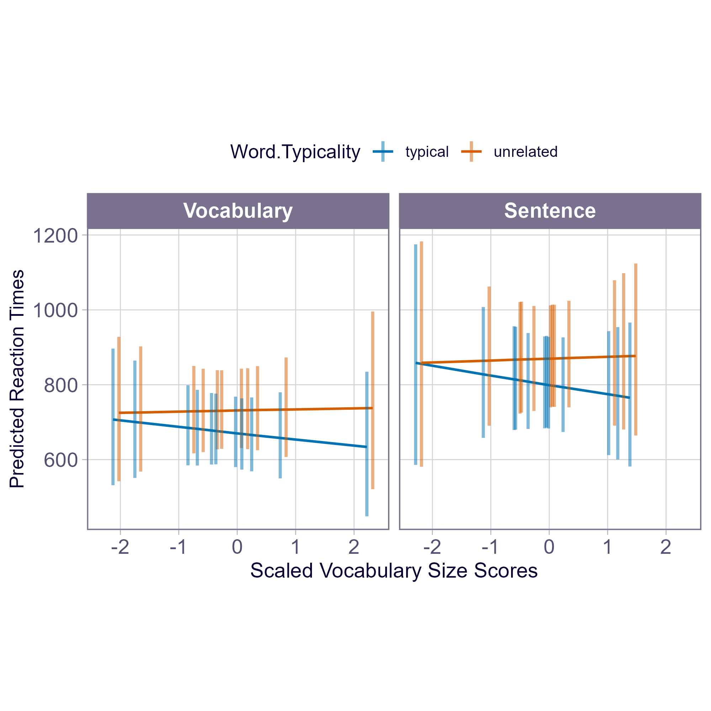
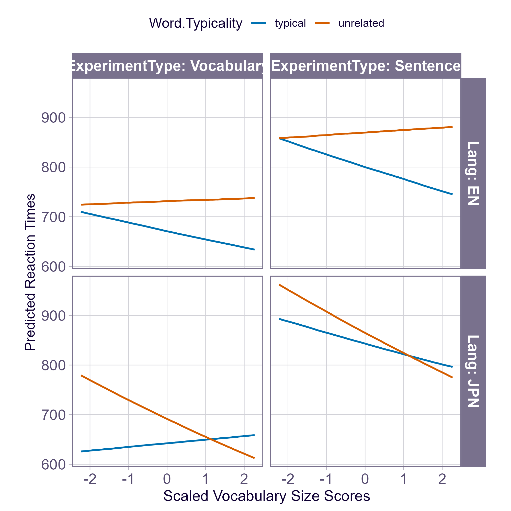

# Summary of the Presentation

# Background

## Embodied Cognition Approach
- Previous studies have shown that readers rely on both linguistic and non-linguistic information, such as object shape and color, during language processing (Barsalou, 2008).

## Activation of Color Information
### Connell and Lynott (2009, *Psychonomic Bulletin & Review*)

- Activation of Object color information

- Semantic Stroop task
  1. Read a sentence (e.g., *Joe was excited to see a bear in the woods.*)
  2. A keyword is presented in color ( <font color="brown">**bear**</font> )
  3. Answer the color of the font

## Stroop Effect
### Receiving inconsistent information causes inhibition.

- The presence of the Stroop effect is evidence of color activation. 

## Connell and Lynott (2009)

- Two types of sentences

  - e.g., *Joe was excited to see a bear in the woods*: **brown bear**

  - e.g., *Joe was excited to see a bear at the North Pole*: **polar bear**

- Three font colors

  - typical color: *bear* in Brown
  
  - atypical color: *bear* in White

  - unrelated color: *bear* in Green

## Connell and Lynott (2009)
- Reaction times were faster when the indicated color matched the font color, compared to when they mismatched.

- Sentence (*Joe was excited to see a bear in the woods*): 🐻

```{r}
#| fig-align: center
#| echo: false
#| out.width: "80%"

```

## Connell and Lynott (2009)
- There were no significant differences between the atypical and unrelated conditions.

  - Readers activated only the typical color of an object.
  
    - *Joe was excited to see a bear in the woods*: 🐻

    - *Joe was excited to see a bear at the North Pole*: 🐻

- There was no evidence of atypical color activation.

## Terai (2023, *Doctoral thesis*)

- Replicated Connell and Lynott (2009) in both the first and second language

- Interaction of second language proficiency and typicality (in the second language)

- 図を挿入?

::: {.callout-note}
Second language proficiency was operationalized using vocabulary size scores.
:::

- \* L1 English: Terai & Yamashita (in Print, *Journal of Psycholinguistic Research*)

## Terai (2026, *Applied Psycholinguistics*)

* Responses to typical colors were faster regardless of the type of sentence presented

  * Is typical color information activated even without a sentence?

  * What happens when differences in the processing speed of individual words are taken into account?

## Activation of Color Information (Follow-up Study)

* Responses to typical colors were faster regardless of the type of sentence presented

  * Is typical color information activated even without a sentence?

  * What is the effect of word-processing speed?

  * What happens if language is manipulated within participants?

## Activation of Color Information (Follow-up Study)

::: {layout-ncol=2}



:::

## Activation of Color Information (Follow-up Study)

* Participants completed the semantic Stroop task in both Japanese and English

* They also completed a lexical decision task to measure their response times to the words used in the Stroop task

## Activation of Color Information (Follow-up Study)

:::: {.columns}

::: {.column width="50%"}
{width="100%"}
:::

::: {.column width="50%"}

* No Stroop effect was observed

  * Color information may not always be activated

* In the lexical decision task, mean response times were faster in Japanese, whereas in the Stroop task, responses were faster in English
:::

::::

## Summary of the Previous Studies

- Even a language learned in a foreign-language environment can activate color information during language processing in a way similar to the L1

  - A certain level of L2 proficiency may be necessary

  - Color information is not always activated (Weak Embodiment)

    - Presence of Context may elicit stronger Stroop effect?

## Toward the Study

- Did presence of context elicite larger Stroop effects than without presenting sentences?

# The Study

## Research Hypotheses

- (1) Reaction times will be faster for words presented in typical colors than in unrelated colors, particularly when a sentence is presented immediately before the Stroop task, and in their L1 (JPN)

- (2) The magnitude of the Stroop effect will be modulated by L2 proficiency during L2 task performance.

## Participants
- Twenty-four Japanese learners of English were recruited at a Japanese university. 

- English proficiency: scores of a yes-no vocabulary size test (Meara & Miralpeix, 2015). The vocabulary test scores indicated that participants’ English proficiency ranged from low to intermediate, which was comparable to the participants in Terai (2026)

## Procedures

- Each participants completed both a with-sentence and word-only Stroop task.

- Language of the task was also withn-subject design

    - e.g., Participant A: with-sentence (Eng), word-only (Jpn)

    - e.g., Participant B: with-sentence (Jpn), word-only (Eng)

## Difference of the task

- To reduce the number of trials, atypical color conditions were eliminated

    typical vs. unrelated

- The Stroop word was inserted in black font before Stroop phase

    - By adding this phase, the present study made the two tasks more comparable: the critical difference between the tasks was whether the prior presentation consisted of a sentence or a single word.
- incert 画像

# Analysis

## Data Exclusion

- All data from participants whose overall accuracy in the Stroop task (separately for each language) was below 80% (confirmed at both the sentence and word levels).

- Trials whose reaction times deviated from the median by more than + 3 median absolute deviations.

- Reaction-time data shorter than 200 ms.

- incorrect response

## Bayesian mixedeffects regression models
- Dependent variable: Reaction times in the Stroop task

- Independent variables:  color typicality (typical vs. unrelated), task type (sentence-context vs. word-only), task language (L1 vs. L2), scaled vocabulary size scores, and their interactions. 

- Random intercepts and random slopes: participants- and experimental items-levels

# Results

## Hypothesis 1

- The difference between typical and unrelated was larger in L2 (ENG).

    - Main Effect of Task Type was robust: regardless of task language and word typicality, reaction times were faster in word-level Stroop task.

```{r}
#| fig-align: center
#| echo: false
#| out.width: "90%"

```

## Hypothesis 1

- contrasts of the estimated marginal means showed that the predicted medians were generally faster in the typical color condition than in the unrelated color condition. 


- Stroop effects tend to be larger in L1

```{r}
#| fig-align: center
#| echo: false
#| out.width: "90%"

```

## Hypothesis 2

- Stroop effects tend to be larger as the test takers' vocabulary size increases.

```{r}
#| fig-align: center
#| echo: false
#| out.width: "90%"

```

## Hypothesis 2

- Stroop effects tend to be larger as the test takers' vocabulary size increases.

```{r}
#| fig-align: center
#| echo: false
#| out.width: "90%"

```


# Discussion
## Hypothesis 1
::: {style="background-color: #cde5f5; border: 1px solid steelblue; padding: 10px; border-radius: 6px;"}
Reaction times were faster for words presented in typical colors than in unrelated colors, ~~particularly when a sentence is presented immediately before the Stroop task,and in their L1 (JPN)~~
:::

- There was Stroop effect in word-only task in L1

    - One possible reason for this discrepancy is that in the word-only task, in which the target word was presented in black font immediately before the Stroop phase. This prior presentation may have facilitate semantic processing compared with a task without such a presentation phase. 

- The Stroop effect was larger in L2 than in L1 in word-only Stroop task. 

    - consistent with Terai (2026) 
    
    - Participants may have focused more strongly on reading the words in their L2, a language in which they were less proficient. This may have led to stronger activation of the color.

- This finding is not fully with Terai (2023), which reported strong evidence for color simulation in L1 with sentence-context.

    - very weak Stroop effect in with-sentence task in L1

- These results suggest that typical color information may be activated even in the absence of a sentence context. 


## Hypothesis 2

::: {style="background-color: #cde5f5; border: 1px solid steelblue; padding: 10px; border-radius: 6px;"}
〇 The magnitude of the Stroop effect will be modulated by L2 proficiency during L2 task performance.
::: 

- Learners with higher proficiency tended to show a larger Stroop effect than learners with lower proficiency in L2 tasks, regardless of task type.

- Interestingly, lower proficiency test takers show larger Stroop effect in L1 than higher proficiency learners regardless of task types.

# Conclusion

## 

# References