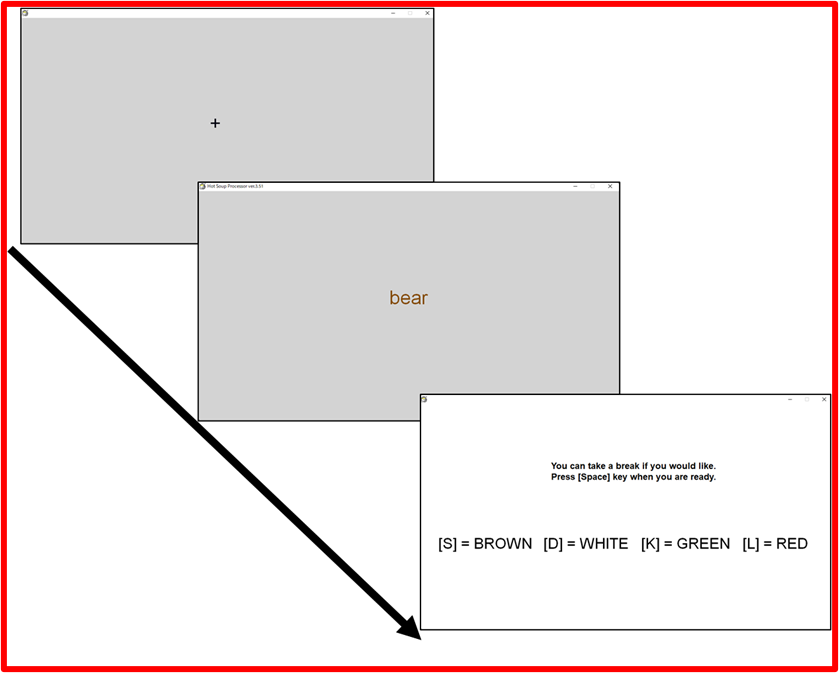
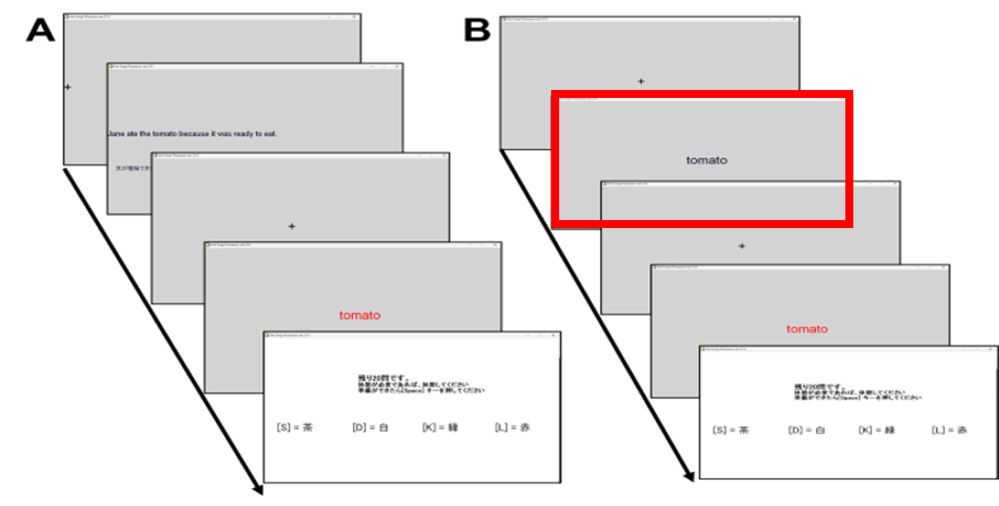
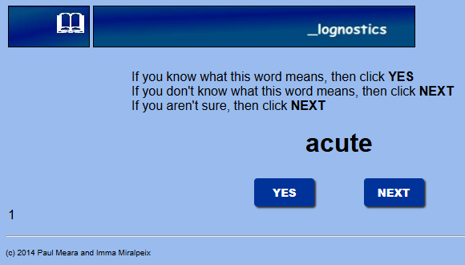

## Grounded Cognition Approach
- Readers rely on both linguistic and non-linguistic information during language processing (e.g., Barsalou, 2008).

```{r}
#| fig-align: center
#| echo: false
#| out.width: "80%"

```

## Terai (2023, *Doctoral thesis*)

- Activation of Object color information (e.g., *bear* = BROWN)

- Semantic **Stroop task**

## Stroop Effect
### Receiving inconsistent information causes inhibition.

<center>
<span style="font-size: 700%; color: red;">Red </span>
<span style="font-size: 700%; color: blue;">Red </span>
</center>
<!-- <center>
<span style="font-size: 700%; color: blue;">赤  </span>
<span style="font-size: 700%; color: red;"> 赤</span>
</center> -->

## Stroop Effect

```{r}
#| fig-align: center
#| echo: false
#| out.width: "80%"
knitr::include_graphics("fig/stroop.png")
```

- The presence of the Stroop effect is evidence of color activation

## Terai (2023, *Doctoral thesis*)
- Semantic Stroop task

::: {.incremental}
  1. Read a sentence (e.g., *Joe was excited to see a bear in the woods.*)
  2. A keyword is presented in color ( <font color="brown">***bear***</font> )
  3. Answer the color of the font by pressing keys
:::

## Terai (2023, *Doctoral thesis*)

- Two types of sentences

  - e.g., *Joe was excited to see a bear in the woods*: **brown bear**

  - e.g., *Joe was excited to see a bear at the North Pole*: **polar bear**

::: callout-important
No color words (e.g., red, blue) were used in the sentences.
:::

- Three font colors

  - typical color: <font color="brown">***bear***</font>
  
  - atypical color: <span style="color: white; background-color: grey;"><strong>*bear*</strong></span>

  - unrelated color: <font color="green">***bear***</font>

## Terai (2023, *Doctoral thesis*)

- 15 concrete nouns

  - apple, ball, bear, cake, chameleon, cloud, horse,
kiwi, leaf, onion, plum, popcorn, steak, strawberry, and tomato

- English native speakers, Japanese native speakers.

## Terai (2023, *Doctoral thesis*)

- Readers activated only the typical color of an object.
  
    - *Joe was excited to see a bear in the woods*: 🐻

    - *Joe was excited to see a bear at the North Pole*: 🐻

- No evidence was found for the activation of atypical colors.

::: {.callout-note}
L1 English data : [Terai & Yamashita (in Print, *Journal of Psycholinguistic Research*)](https://link.springer.com/article/10.1007/s10936-026-10310-4)
:::

## Terai (2023, *Doctoral thesis*)

- Japanese speakers performed in English

    - Interaction of second language proficiency and typicality 

- Higher proficiency learners showed larger Stroop effects

## A Further Question

- Is typical color information activated even without a sentence context?

  - Color information was activated when a task encouraged the involvement (Huettig et al., 2020)

  - Color information may not always be activated. 

## Terai (2026, *Applied Psycholinguistics*)

- Language was manipulated within subjects.

::: {layout-ncol=2}



:::

## Terai (2026, *Applied Psycholinguistics*)

:::: {.columns}

::: {.column width="50%"}
{width="100%"}
:::

::: {.column width="50%"}

- L1 (JPN): No Stroop effects

- L2 (ENG): Weak Stroop effects
:::

::::

## Summary of the Previous Studies

- Color information is not always activated

  - Sentence context may elicit a stronger Stroop effect.

- A certain level of L2 proficiency may be necessary for color activation in L2 processing.

# The Study

## Toward the Present Study

- Did sentence context elicit a larger Stroop effect than no sentence context?

  - Experiment type (Sentence vs. Vocabulary-only) was manipulated within subjects.

## Difference Between the Tasks
- The Stroop word was presented in black font

    - the main difference was whether participants saw a **sentence** or a **single** word beforehand.



## Research Hypotheses

1. The Stroop effect will be smaller in the vocabulary-only Stroop task.

2. The Stroop effect will be larger for learners with higher L2 proficiency.

## Participants
- Twenty-four Japanese learners of English were recruited at a Japanese university. 

- English proficiency was measured using a yes/no vocabulary size test (Meara & Miralpeix, 2015). 

  - Participants had relatively low English proficiency (*M* = 2223, Range = 250--4913)



## Experiment

- Experiment type and task language were both manipulated within subjects.

    - e.g., Participant A: Sentence (ENG), vocabulary-only (JPN)

    - e.g., Participant B: Sentence (JPN), vocabulary-only (ENG)

- To reduce the number of trials, atypical color conditions were eliminated.

  - typical vs. unrelated

<!-- # Analysis

## Data Exclusion

- All data from participants whose overall accuracy in the Stroop task was below 80%.

- Trials whose reaction times deviated from the median by more than + 3 median absolute deviations.

- Reaction-time data shorter than 200 ms.

- incorrect response
 -->

## Bayesian Regression models

- Compared statistical values (e.g., mean, median) of the designated conditions.

  - No hypothesis testing  (e.g., p-value, Bayes Factor).

<!-- 
- Dependent variable: Reaction times in the Stroop task

- Independent variables: 

    - Word-color typicality (typical vs. unrelated)
    
    - Task type (sentence-context vs. word-only)
    
    - Task language (L1 vs. L2)
    
    - Scaled vocabulary size scores
    
    - Interactions of the above 

- Random intercepts and random slopes: participants- and experimental items-levels -->

# Results & Discussion

## Hypothesis 1

```{r}
#| fig-align: center
#| echo: false
#| out.width: "90%"
knitr::include_graphics("fig/FigA.png")
```

## Hypothesis 1

```{r}
#| fig-align: center
#| echo: false
#| out.width: "90%"
knitr::include_graphics("fig/FigC.png")
```

::: callout-caution
The 95% credible interval of the posterior distribution includes zero.
:::

## Hypothesis 1
::: {style="background-color: #cde5f5; border: 1px solid steelblue; padding: 10px; border-radius: 6px;"}
✖ The Stroop effect will be smaller in the vocabulary-only Stroop task.
:::

- There was no large difference in the Stroop effect between sentence and vocabulary-only Stroop tasks.

  - Presenting a sentence does not necessarily facilitate color activation.
  
- Presenting the word beforehand may have facilitated semantic processing compared with a task without this presentation phase.
 
## Hypothesis 2


## Hypothesis 2

::: {style="background-color: #cde5f5; border: 1px solid steelblue; padding: 10px; border-radius: 6px;"}
⭕ The Stroop effect will be larger for learners with higher L2 proficiency.
::: 

- Learners with higher L2 proficiency tended to show a larger Stroop effect than those with lower proficiency in L2 tasks, regardless of task type.

  - Consistent with Terai (2023)

## Conclusion
- Readers are likely to activate typical color associated with an inferred object even without seeing color words (e.g., red, blue, green).

- In L2 processing, color activation appears to be stronger in learners with higher L2 proficiency.

## References (1)
- Barsalou, L. W. (2008). Grounded cognition. *Annual Review of Psychology, 59*(1), 617–645. [https://doi.org/10.1146/annurev.psych.59.103006.093639](https://doi.org/10.1146/annurev.psych.59.103006.093639)

- Huettig, F., Guerra, E., & Helo, A. (2020). Towards understanding the task dependency of embodied language processing: The influence of colour during language vision interactions. *Journal of Cognition, 3*(1), 41, 1–19. [https://doi.org/10.5334/joc.135](https://doi.org/10.5334/joc.135)

- Meara, P., & Miralpeix, I. (2016). *Tools for researching vocabulary*. Multilingual Matters. [https://doi.org/10.21832/9781783096473](https://doi.org/10.21832/9781783096473)

## References (2)
- Terai M. (2023). *Activation of color information in second language comprehension* [Doctoral Dissertation,
Nagoya University]. NAGOYA Repository. [https://nagoya.repo.nii.ac.jp/records/2005609](https://nagoya.repo.nii.ac.jp/records/2005609)

- Terai, M. (2026). Color information activation in first and second language word processing. *Applied Psycholinguistics, 47*, e41. [https://doi.org/10.1017/S0142716426100824](https://doi.org/10.1017/S0142716426100824)

# Acknowledgements
- This study was supported by JSPS KAKENHI Grant Number 24K16142.